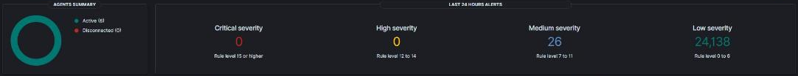
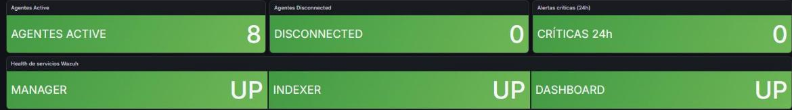

# SecOps Governance Blueprint

> Seguridad operada como en una empresa, sobre una infraestructura propia que no se apaga: SIEM, deteccion, endurecimiento medido y controles que se prueban haciendolos fallar.

  
  
  
  
  
  

Este repositorio es la **capa de seguridad** de una infraestructura productiva
personal: chica en escala, completa en piezas, encendida 24/7 sobre un
hipervisor de tipo 1 (Proxmox VE). Cuenta como se opera el SOC -visibilidad,
deteccion, endurecimiento y respuesta- y, sobre todo, **por que** se decidio
cada cosa.

La documentacion operativa es privada. Esto es su version transformada: no
publica reglas, umbrales exactos, configuraciones ni brechas abiertas.

## En 30 segundos

| Indicador | Resultado |
|---|---|
| Puertos entrantes abiertos a internet | **0** |
| Hosts con SSH solo por clave, verificado contra la configuracion efectiva | **7 de 7** |
| Permisos privilegiados genericos para agentes de IA | **0**: la lista salio de medir 25 invocaciones reales |
| Agentes del SIEM activos | **8**, cero desconectados |
| Intentos no autorizados frenados por la politica de acceso en un solo incidente | **13.017** |
| Exporters y sondas monitoreados, con alerta solo ante fallas | **13** y **25** |
| Controles del Anexo A de ISO 27001 implementados con evidencia | **19 de 24** |
| Riesgos tratados y registrados, con su evaluacion corregida | **10** |

## Mapeado a ISO/IEC 27001:2022

La operacion esta mapeada al **Anexo A de ISO/IEC 27001:2022**: **24 controles**, **19 implementados con evidencia** y 5 parciales con direccion definida.

| Area | Controles destacados |
|---|---|
| Acceso e identidad | 5.15 control de acceso, 5.18 derechos de acceso, 8.2 acceso privilegiado, 8.5 autenticacion segura |
| Deteccion y registro | 8.15 registro de eventos, 8.16 monitoreo, 8.7 proteccion contra malware |
| Red | 8.20 seguridad de redes, 8.22 segregacion, 8.23 filtrado web |
| Continuidad | 8.13 copias de seguridad, 5.30 preparacion para la continuidad |
| Gestion | 5.24 incidentes, 8.32 gestion de cambios, 8.9 configuracion |

Detalle control por control: [Mapeo ISO 27001](docs/02-mapeo-iso-27001.md). Riesgos tratados: [Registro de riesgos](docs/03-registro-de-riesgos.md).

## En vivo

_Capturas reales del entorno, con nombres, direcciones, usuarios y versiones reemplazados por su funcion._

Wazuh en 24 horas: 8 agentes activos y cero alertas criticas o altas.

El SIEM integrado al monitoreo: agentes y servicios del propio SIEM vigilados.

Alertas al telefono: solo cuando algo falla y cuando se resuelve.

Acceso remoto sin puertos abiertos: nodos firmantes (tailnet lock), subnet router y exit node.

## Problema, decision, resultado

| Problema | Por que importaba | Que se hizo | Resultado |
|---|---|---|---|
| Apagar el servidor por accidente dejo sin internet al equipo principal | un riesgo registrado como "bajo" se materializo al dia siguiente | probar la mitigacion **haciendola fallar**; la primera no funcionaba | resolucion con respaldo en toda la malla, verificada en tres equipos |
| 13.017 rechazos de politica sin una sola alerta | la defensa funcionaba pero nadie lo veia | decodificador, reglas y umbral calibrado con el incidente | deteccion validada con trafico real |
| Un agente de IA con privilegio total sin haberlo pedido | una regla que se cumple por voluntad no es un control | lista de permisos derivada del uso medido | 3 de 3 pruebas negativas denegadas |
| Siete verificaciones de seguridad informaban algo falso | un control que miente da confianza sin proteger | verificar el efecto y lo que tiene que fallar | practica aplicada a todo script |

## Indice

- [Ficha rapida para quien evalua](contexto.md)
- [Postura SecOps: capas, controles y lo que se decidio NO hacer](docs/01-postura-secops.md)
- [Mapeo ISO/IEC 27001:2022, Anexo A](docs/02-mapeo-iso-27001.md)
- [Registro de riesgos](docs/03-registro-de-riesgos.md)
- [Caso de estudio: el DNS que se llevo internet](docs/casos-de-estudio/01-el-dns-que-se-llevo-internet.md)
- Casos relacionados en la serie: [13.017 rechazos que nadie vio](https://github.com/Nicolasperaltait/alerts-that-matter/blob/main/docs/casos-de-estudio/02-trece-mil-rechazos-invisibles.md), [controles que mentian](https://github.com/Nicolasperaltait/alerts-that-matter/blob/main/docs/casos-de-estudio/01-cuando-un-control-no-mide-lo-que-dice-medir.md), [agentes de IA con minimo privilegio](https://github.com/Nicolasperaltait/zero-trust-remote-access/blob/main/docs/casos-de-estudio/01-acceso-de-agentes-de-ia-y-minimo-privilegio.md)

## Parte de una serie

Este repo es una pieza de **[Homelab Prod](https://github.com/Nicolasperaltait/homelab)**:
la vista completa de una infraestructura productiva, chica en escala y completa
en piezas, encendida 24/7. Cada repo de la serie se lee solo; la portada los une.

- [Zero Trust Remote Access](https://github.com/Nicolasperaltait/zero-trust-remote-access)
- [Network Segmentation Playbook](https://github.com/Nicolasperaltait/network-segmentation-playbook)
- [Alerts That Matter](https://github.com/Nicolasperaltait/alerts-that-matter)
- [Backups That Don't Lie](https://github.com/Nicolasperaltait/backups-that-dont-lie)
- [Hypervisor as Control Plane](https://github.com/Nicolasperaltait/hypervisor-as-control-plane)
- [SecOps Governance Blueprint](https://github.com/Nicolasperaltait/secops-governance-blueprint) (este repo)

## Licencia

Ver [LICENSE.md](LICENSE.md).
