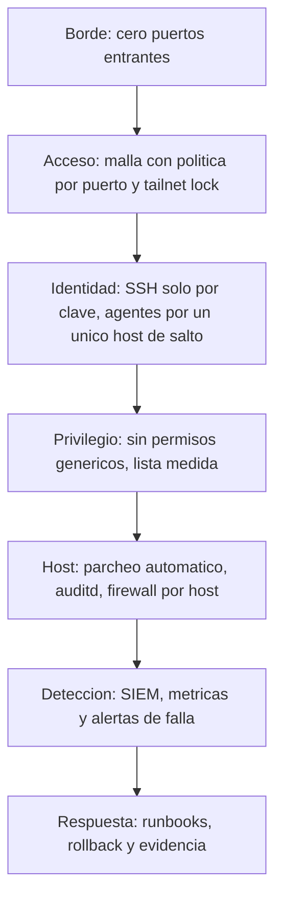

# Postura SecOps

> Estado descrito: octubre de 2026.

## Principio rector

**No se cambia lo que no se midio, y no se retira lo que no tiene reemplazo probado.**

| Regla | Por que existe |
|---|---|
| Primero el reemplazo, probado; despues se retira lo viejo | dos veces se perdio acceso a un host por invertir ese orden |
| Un control se prueba haciendolo fallar | que algo funcione no dice si rechaza lo que debe rechazar |
| Ante la duda, se mide | las decisiones salen de datos, y los huecos se marcan como huecos |

## Capas

| Capa | Control | Como se verifico |
|---|---|---|
| Acceso remoto | malla con politica propia, deny por defecto; ningun puerto hacia internet | relevamiento del borde y de la politica |
| Autenticacion | SSH solo por clave en los 7 hosts | configuracion **efectiva** del servicio, no el archivo escrito |
| Identidad de agentes de IA | un solo camino, con interruptor manual en el hipervisor | credenciales confinadas al host de salto y restringidas por origen |
| Privilegio | ningun permiso generico en ningun host | lector generico e interprete **denegados** |
| Cuentas | cuentas en desuso retiradas: reemplazo, prueba y recien despues retiro | acceso de rescate verificado por consola |
| Parcheo | automatico, nocturno y observable en los 7 hosts | metrica de ultima corrida con alerta por atraso |
| Auditoria del sistema | auditd en los 7 hosts, con techo de espacio y ritmo medido | volumen diario medido antes de ajustar |
| Deteccion | SIEM con agentes en hosts y estacion de trabajo, reglas propias | eventos reales, no sinteticos |
| Observabilidad | 13 exporters y 25 sondas, alertas solo de fallas | canal de alertas con destino verificado |

## Lo que se decidio NO hacer, y por que

Esta tabla existe para que nadie lo "arregle" despues sin leer el motivo. Es la
parte que mas criterio muestra: **saber que no tocar.**

| Decision | Motivo |
|---|---|
| NO borrar el DNS de respaldo de un host critico, aunque el ticket lo pedia | ese respaldo es lo unico que mantiene resolviendo nombres al host de las aplicaciones si el DNS interno cae. **Se cambia el respaldo, no se borra** |
| NO volver inmutables las reglas de auditoria todavia | quedarian fijas hasta reiniciar; primero cada host tiene que tener su medicion de 24 horas |
| NO apagar un host cuando se llena el espacio de auditoria, aunque el benchmark lo recomienda | apagar produccion por logs de auditoria es peor que la falla que se quiere registrar |
| NO instalar un firewall nuevo en todos los hosts | el relevamiento mostro que la mayoria ya filtraba; se completa con la herramienta de cada host |
| NO dejar una via de emergencia para el agente de IA | si el host de salto esta apagado, se pide encenderlo; el rescate es la identidad del operador y la consola fisica |

## En maduracion

| Tema | Direccion |
|---|---|
| Ingesta de la auditoria del sistema en el SIEM | sumar la fuente con filtros, sin inundar el SIEM |
| Ruido del SIEM | subir umbrales donde el volumen es ruido conocido y clasificado |
| Deteccion por metrica de rechazos de la malla | complementar el registro, que limita su tasa |

## Idea central

La seguridad de esta infraestructura no se apoya en una herramienta. Se apoya en
medir antes de cambiar, probar cada control haciendolo fallar, y documentar
tanto lo que se hizo como lo que se decidio no hacer.
